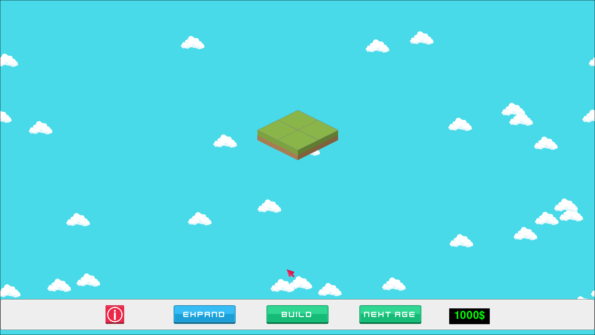
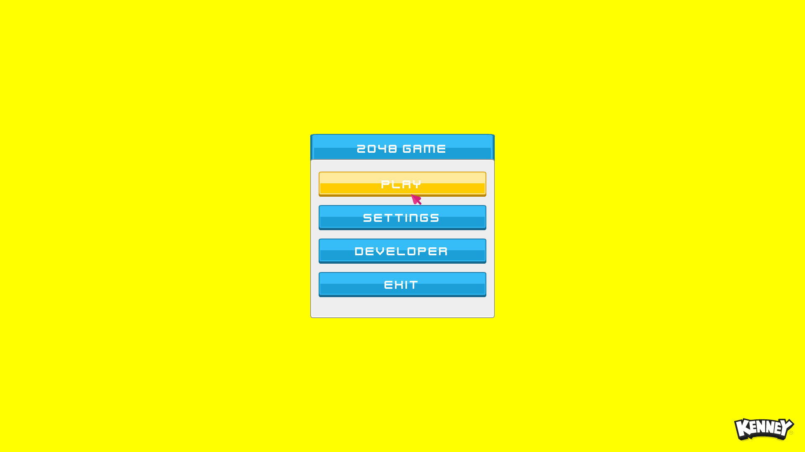
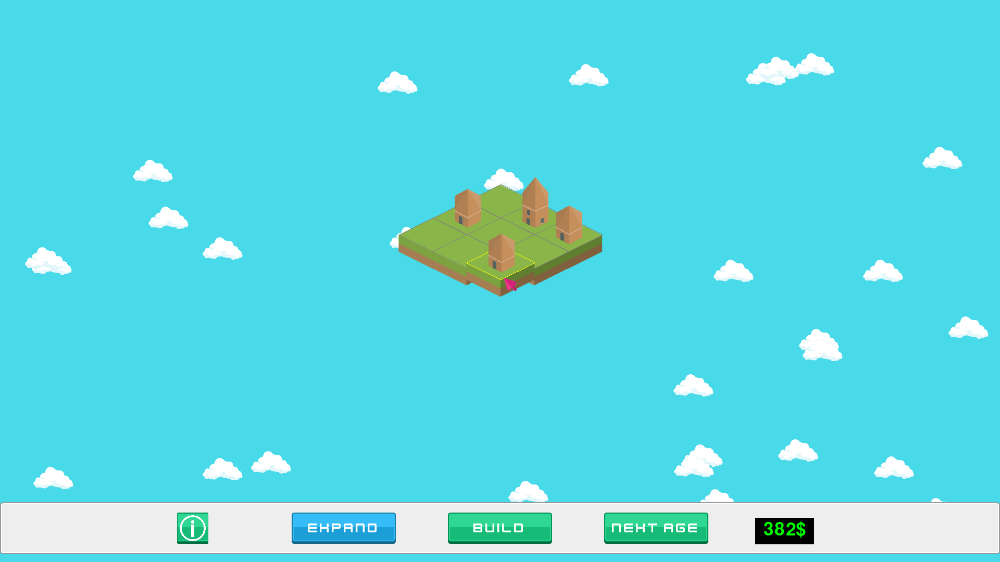
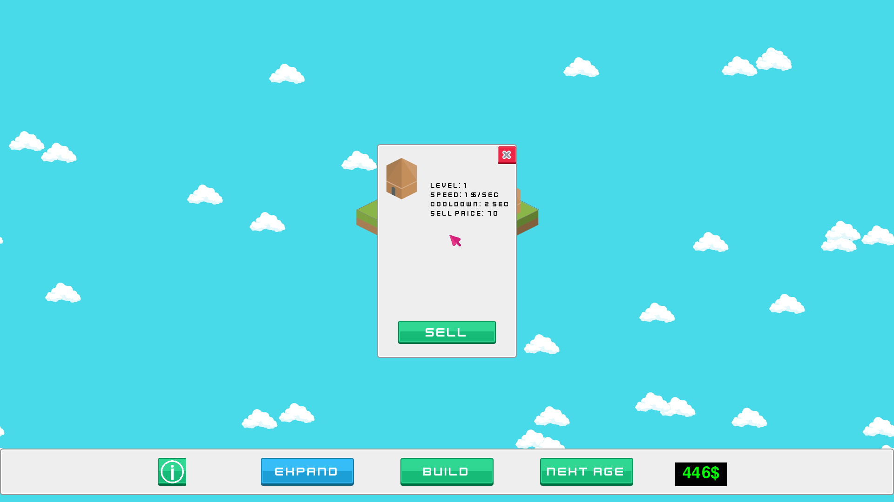

# 2048 Idle Evolution

An isometric city-builder where same-level buildings merge `2048`-style. Build, merge, expand, and advance through ages — Python + [pygame-ce](https://github.com/pygame-community/pygame-ce).



## Gameplay

Place buildings on the isometric grid, then slide them with WASD/arrows to merge same-level neighbours into a higher-level building (just like 2048). Higher-level buildings produce more income. Spend income to construct new buildings, expand the land, or advance to the **next age** to unlock better building tiers.

### Screenshots

| Menu | Build mode | Inspection |
|------|------------|------------|
|  |  |  |

### Controls

| Action | Input |
|---|---|
| Move building (merge direction) | WASD / Arrow keys |
| Construct a building | Spacebar |
| Toggle inspection mode | INFORMATION button |
| Build a new building | BUILD button |
| Expand the land | EXPAND button |
| Advance to next age | NEXT AGE button |
| Inspect / sell building | Click a building in inspection mode |

## Requirements

- Python 3.12+
- [pygame-ce](https://github.com/pygame-community/pygame-ce), pyyaml (resolved automatically from `pyproject.toml` / `uv.lock`)
- [uv](https://docs.astral.sh/uv/) (optional but recommended)

## Running

```bash
git clone --recurse-submodules https://github.com/umutcanekinci/2048-idle-evolution.git
cd 2048-idle-evolution
uv sync
uv run python __main__.py
```

If you forgot `--recurse-submodules`: `git submodule update --init`.

Without `uv`: `pip install .` then `python __main__.py`.

## Project layout

```
__main__.py            Entry point — injects src/ + src/pygame_core/ into sys.path
src/app/game.py        Game class — wires Application + Events + Persistence mixins
src/domain/            Pure data (Player)
src/gameplay/          Tilemap, tile selector, buildings, clouds
src/ui/                Info panel and UI helpers
src/pygame_core/       Engine submodule (Application, PanelLoaderExt, Database, ...)
config/                YAML: assets, panels, settings
databases/             SQLite save file (auto-created on first run)
assets/                Images, sounds, fonts
```

See [CLAUDE.md](CLAUDE.md) for the full architecture overview.

## Contributing

1. Fork this repository.
2. Clone your fork: `git clone --recurse-submodules https://github.com/<you>/2048-idle-evolution.git`
3. Create a branch: `git checkout -b feature/<your-feature>`
4. Commit + push: `git commit -am "<message>" && git push origin feature/<your-feature>`
5. Open a pull request.

## Author

Umutcan Ekinci — [umutcannekinci@gmail.com](mailto:umutcannekinci@gmail.com)

See also the [contributors](https://github.com/umutcanekinci/2048-idle-evolution/contributors).

## License

This project is licensed under the MIT License — see the [LICENSE](LICENSE) file.
